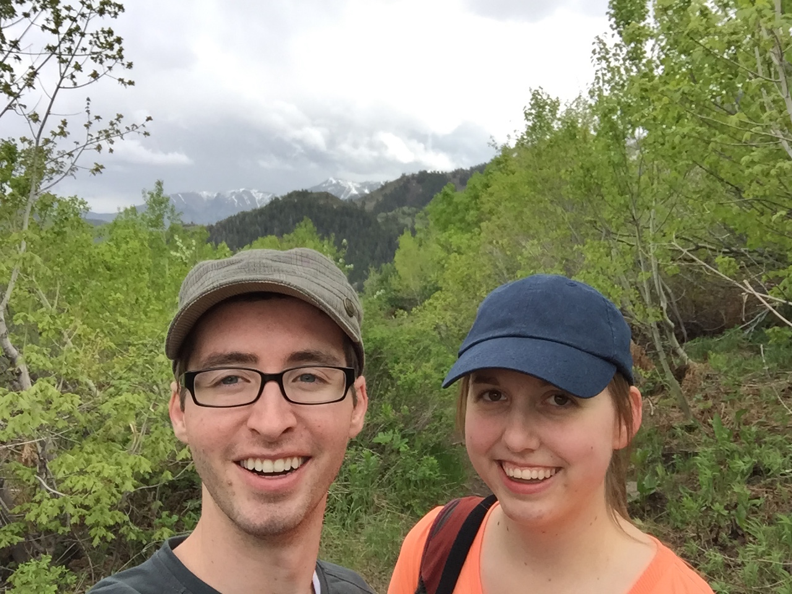

### Stewart Falls
[Map](https://www.google.com/maps/place/Stewart+Falls+Trail,+Provo,+UT+84604/@40.3940606,-111.6025517,15.15z/data=!4m5!3m4!1s0x874d8932cf416b57:0x4e60d2a2871d818e!8m2!3d40.3957103!4d-111.6017604)

#### Overall Rating

#### Difficulty

There a trickier section near the trailhead that may prove slightly difficult for children, old timers, and new hikers, but the majority of the trail is flat and well-kept.

#### Location
About a thirty minute drive from our house. Head toward Sundance on I-92 and continue north until you find the National Parks booth. The parking lot, trail head, and bathrooms are to the left directly after the booth.

#### Fee
$6 (in cash) is required for the National Parks pass. The pass is good for three days and expires at noon on the third day.

### Notes
We have yet to make it to the actual falls. We turned back early our first time because of impending bad weather.

### Photos

